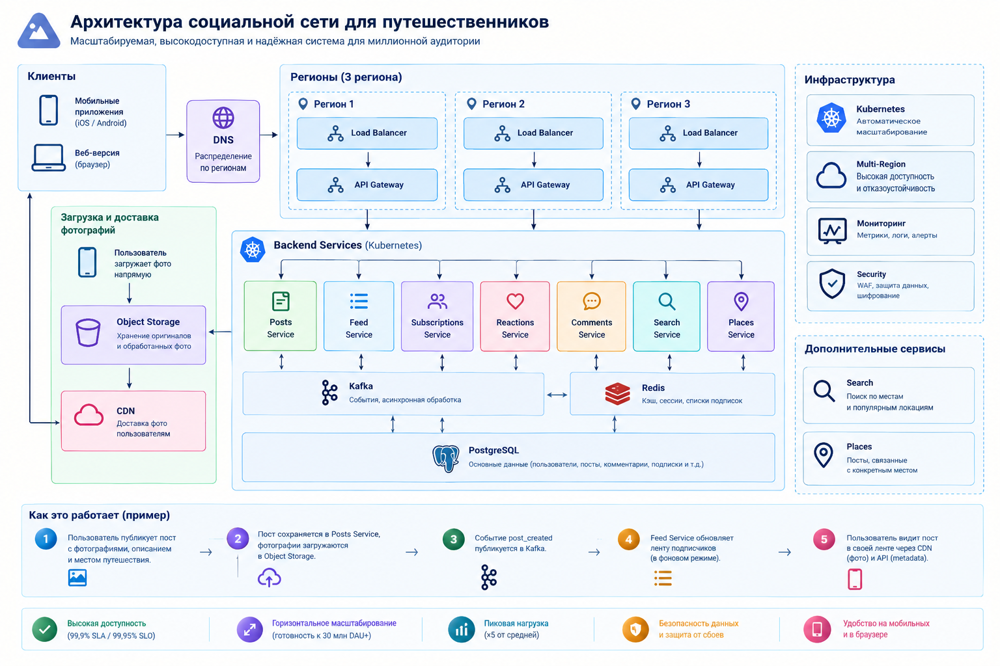

# Социальная сеть для путешественников

Домашняя работа для [курса Владимира Балуна по System Design](https://balun.courses/courses/system_design).

## Функциональные требования:

### Посты (Post)

Пользователь может публиковать посты из путешествий.

Пост содержит:

- фотографии (максимум - 10 штук)
- текстовое описание (максимум - 2000 символов)
- привязку к конкретному месту путешествия
- посты хранятся бессрочно

### Лайки (Reactions)

- Пользователь может оценивать посты других путешественников.

### Комментарии (Comments)

- Пользователь может оставлять комментарии к постам.
- Пользователь может открывать список комментариев к постам и читать их.

### Подписки (Subscriptions)

- Пользователь может подписываться на других путешественников.
- Пользователь может отписываться от других путешественников.
- Число подписок и подписчиков не ограничено.

### Лента (Feed)

- Пользователь может просматривать свою ленту, сформированную из публикаций пользователей, на которых он подписан.
- Посты в ленте отображаются в обратном хронологическом порядке.
- Пользователь может просматривать посты другого путешественника.
- Пользователь может просматривать свои посты.

### Поиск (Search)

- Пользователь может пользоваться поиском популярных мест для путешествий: ввести название региона или города и получить список из 10 мест, популярных у путешественников в этой области

### Места (Places)

- Пользователь может выбрать одно из найденных мест и просмотреть посты, связанные с этим местом.

### Клиенты

Система должна быть доступна через мобильные устройства и браузер.

## Нефункциональные требования:

### Масштабируемость

- Система должна поддерживать не менее 10 млн DAU.

- Архитектура должна позволять горизонтально масштабироваться без изменения бизнес-логики - за счет добавления дополнительных экземпляров приложения.

- Доступность: **SLO:** - 99,95% доступности в месяц.

- Производительность (во всех сервисах - p95):
  - Лайки (Reactions) - ≤ 300 мс
  - Поиск (Search) - ≤ 500 мс
  - Комментарии (Comments) - ≤ 500 мс
  - Посты (Posts) - ≤ 1 с
  - Лента (Feed) - ≤ 1 с
  - Места (Places) - ≤ 1 с

    
- Отказоустойчивость
  - доля ошибок HTTP 5xx — не более 0,1%;
  - отказ отдельного сервиса не должен приводить к отказу всей системы
  - некритичные функции должны деградировать gracefully
    

- Количество одновременных соединений (Concurrent connections)
  - Предполагаем, что в часы максимальной активности приложением одновременно пользуются около 10% DAU - 1 млн пользователей.
  - У каждого пользователя будет открыто в среднем 2 соединения. 
  - С запасом наше приложение должно выдерживать 3 млн соединений одновременно.

## Архитектура нашей системы

    
## Исходные данные от бизнеса и аналитиков

### Данные об активности пользователей:

- DAU — 10 млн
- Peak Concurrent Users (PCU) — 1 млн
- в среднем один активный пользователь поддерживает 2 открытых соединения
- с запасом система должна поддерживать 3 млн одновременных соединений

### Данные о постах

- пользователь создает в среднем 0,1 поста в сутки (то есть в целом 1 млн постов от пользователей в сутки);
- один пост содержит в среднем 3 фотографии;
- средний размер исходной фотографии — 4 МБ;
- сжатая фотография для просмотра в ленте — 200 КБ;
- размер метаданных одного поста в API — 5 КБ

### Данные о ленте

- пользователь открывает ленту 20 раз в сутки;
- одна страница ленты содержит 20 постов;
- 70% фотографий в ленте загружаются благодаря lazy loading;

### Данные о лайках

- пользователь ставит 5 реакций в сутки;
- один запрос/ответ для операции с реакцией — 1,5 КБ

### Данные о комментариях

- пользователь создает 0,5 комментария в сутки (1 комментарий раз в два дня);
- пользователь открывает комментарии к постам 5 раз в сутки;
- одна выдача комментариев содержит 20 комментариев;
- размер одного комментария в API — 1 КБ;

### Данные о поиске

- пользователь выполняет 2 поиска мест в сутки;
- размер результата поиска — 5,5 КБ (изначально у нас выпадает только список названий мест - без постов пользователей и фотографий)
- пользователь кликает на место из поиска 1 раз в сутки;
- после клика пользователь получает выдачу из 20 постов из популярного места

### Данные о подписках

- среднее количество подписок пользователя — 100

### Данные о загрузке фотографий из CDN

- CDN cache hit rate — 90%

## Предварительные расчеты трафика и RPS для всех подсистем нашего приложения

Примечание: Peak RPS рассчитываем как Average RPS × 5. Коэффициент 5 выбран как запас для пиковых периодов нагрузки.

### Посты (Posts)

- Average Write RPS: 1 000 000 постов в сутки / 86 400 секунд ≈ 12 RPS

- Peak Write RPS: 12 RPS × 5 ≈ 60 RPS

- API-трафик: 1 000 000 постов в сутки × 5 КБ метаданных одного поста ≈ 5 ГБ/сутки

- Трафик фотографий (отправляются напрямую в Object Storage, а не идут через API): 1 000 000 постов в сутки × 3 фотографии в среднем × 4 МБ (средний размер фотографии) ≈ 12 ТБ/сутки

### Подписки (Subscriptions)

Один пользователь делает в среднем 0,2 новых подписки и 0,2 отписки в сутки.

10 000 000 пользователей × 0,2 подписки = 2 000 000 подписок/сутки

10 000 000 пользователей × 0,2 отписки = 2 000 000 отписок/сутки

Всего: 4 000 000 операций/сутки

- **Average RPS**: 4 000 000 / 86 400  ≈ 46 RPS

- **Peak RPS**: 46 × 5 ≈ 230 RPS

Для расчета трафика предполагаем, что один запрос на подписку/отписку — это ~500 байт, а ответ сервиса — тоже ~500 байт.

- API-трафик: 4 000 000 × 1 KB = 4 GB/сутки

### Лента (Feed)

#### Чтение персональной ленты пользователя, которая формируется из постов тех людей, на которых он подписан

10 000 000 пользователей × 20 запросов ленты в сутки = 200 000 000 запросов/сутки

- **Average Read RPS**: 200 000 000 запросов ленты / 86 400  ≈ 2 315 RPS

- **Peak Read RPS**: 2 315 RPS × 5 ≈ 11 575 RPS

Одна страница выдачи в ленте содержит 20 постов × 5 КБ метаданных одного поста = 100 КБ

- **Average API-трафик**: 200 000 000 × 100 КБ ≈ 20 ТБ/сутки

- **Peak API-трафик**: 20 ТБ / сутки × 5 ≈ 100 ТБ/сутки

- **Трафик загрузки фотографий, который идет через CDN, а не через API**: 200 млн запросов ленты × 20 постов × 3 фотографии в посте в среднем × 70% (эти фотографии загружается через lazy loading) = 8,4 млрд загрузок фотографий/сутки

#### Обновление ленты всех подписчиков пользователя, когда он делает новый пост

У пользователя в среднем 100 подписчиков, поэтому 1 пост × 100 подписчиков = 100 обновлений materialized feed подписчиков этого пользователя

За сутки: 1 000 000 × 100 = 100 000 000 обновлений

- **Обновления materialized feed - Average Write RPS**: 100 000 000 / 86 400 ≈ 1 157 RPS

- **Обновления materialized feed - Peak Write RPS**: 1 157 × 5  ≈ 5 785 RPS

#### Суммарная нагрузка Ленты:

- **Average RPS**: ≈ 3 472 RPS

- **Peak RPS**: ≈ 17 360 RPS

- **Average API-трафик** 20 ТБ/сутки

- **Peak API-трафик** 100 ТБ/сутки 

### Лайки (Reactions)

В среднем пользователь ставит 5 лайков в сутки.

Среднее количество реакций: 10 000 000 пользователей × 5 лайков = 50 000 000 реакций/сутки

**Average Write RPS**: 50 000 000 реакций / 86 400 ≈ 580 RPS

**Peak Write RPS**: 580 × 5 ≈ 2 900 RPS

Средний размер запроса/ответа - 1,5 КБ

**Average traffic**: 50 000 000 реакций × 1,5 КБ ≈ 75 ГБ/сутки

**Peak traffic**: 75 ГБ × 5 ≈ 375 ГБ/сутки

### Комментарии (Comments)

#### Написание комментария

Пользователь пишет в среднем 0,5 комментария в сутки (1 комментарий раз в два дня)

10 000 000 × 0,5 = 5 000 000 комментариев/сутки

**Average Write RPS**: 5 000 000 / 86 400 ≈ 58 RPS

**Peak Write RPS**: 58 × 5 ≈ 290 RPS

**Average traffic** ≈ 10 ГБ/сутки

**Peak traffic** ≈ 50 ГБ/сутки

#### Чтение комментариев под постом

Пользователь открывает комментарии пять раз в сутки.

10 000 000 пользователей × 5 = 50 000 000 запросов/сутки

**Average Read RPS**: 50 000 000 / 86 400 ≈ 580 RPS

**Peak Read RPS**: 580 × 5 ≈ 2 900 RPS

При выдаче 20 комментариев за один раз - каждый по 1 КБ:

20 × 1 КБ = 20 КБ

**Average traffic:** ≈ 1 ТБ/сутки

**Peak traffic** ≈ 5 ТБ/сутки

#### Общая статистика по комментариям

**Average RPS**: ≈ 638 RPS

**Peak RPS**: ≈ 3 190 RPS

**Average traffic:**: ≈ 1,01 ТБ/сутки

**Peak traffic**: ≈ 5,05 ТБ/сутки

### Поиск (Search)

Пользователь дважды обращается к поиску в сутки.

10 000 000 × 2 = 20 000 000 запросов/сутки

**Average Read RPS**: 20 000 000 запросов / 86 400 ≈ 231 RPS

**Peak Read RPS**: 231 RPS × 5 ≈ 1 155 RPS

При размере ответа 5,5 КБ:

**Average traffic**: 20 000 000 запросов × 5,5 КБ ≈ 110 ГБ/сутки

**Peak traffic**: 110 × 5 ≈ 550 ГБ/сутки

### Популярные места (Places)

Этот сервис позволяет пользователю просматривать посты, связанные с конкретным популярным местом.

Пользователь кликает на одно популярное место из своего поиска в сутки.

10 000 000 пользователей * 1 запрос = 10 000 000 запросов/сутки

**Average Read RPS**: 10 000 000 / 86 400 ≈ 116 RPS

**Peak Read RPS**: 116 × 5 ≈ 580 RPS

Одна выдача в поиске: 20 постов × 5 КБ метаданных каждого поста = 100 КБ

**Average traffic**: ≈ 1 ТБ/сутки

**Peak traffic**: ≈ 5 ТБ/сутки

Фотографии из постов при этом доставляются через CDN.

### CDN

CDN используется для доставки фотографий пользователям.

API возвращает metadata постов и URL/идентификаторы фотографий, а сами фотографии хранятся в Object Storage.

В одном посте - 3 фотографии, одна сжатая фотография весит 200 КБ, 70% фотографий загружается благодаря lazy loading.

#### Загрузка фотографий из ленты (Feed)

200 млн запросов Feed × 20 постов × 3 фотографии × 70% = 8,4 млрд загрузок фотографий/сутки

Загрузка фотографий из поиска популярных мест (Places): 10 млн запросов × 20 постов × 3 фотографии × 70% = 420 млн загрузок фотографий/сутки

**Общая нагрузка на CDN**: 8,4 млрд + 420 млн = 8,82 млрд загрузок/сутки

**Average RPS**: 8,82 млрд / 86 400 ≈ 102 000 RPS

**Peak RPS**: 102 000 × 5 ≈ 510 000 RPS

**Трафик к пользователям**: 8,82 млрд запросов × 200 КБ (размер одного фото) ≈ 1,76 ПБ/сутки

**Peak traffic**: 1,76 ПБ × 5 ≈ 8,8 ПБ/сутки

### Object Storage

#### Запись фотографий в Object Storage

Object Storage используется для хранения фотографий.

**Трафик**: 1 000 000 постов в сутки × 3 фотографии в одном посте × 4 МБ ≈ 12 ТБ новых данных в сутки

1 000 000 постов × 3 фотографии = 3 000 000 фотографий/сутки

**Average Write RPS**: 3 000 000 / 86 400 ≈ 35 RPS

**Peak Write RPS**: 35 × 5 ≈ 175 RPS

#### Чтение фотографий из Object Storage

У нас CDN cache hit rate 90%, а значит, только 10% данных необходимо получать из Object Storage.

8,82 млрд × 10% = 882 млн запросов/сутки

**Average Read RPS**: 882 000 000 / 86 400 ≈ 10 200 RPS

**Peak Read RPS**: 10 200 × 5 ≈ 51 000 RPS

**Average трафик**: 1,76 ПБ × 10% ≈ 176 ТБ/сутки

**Peak трафик**: 176 ТБ × 5 ≈ 880 ТБ/сутки

