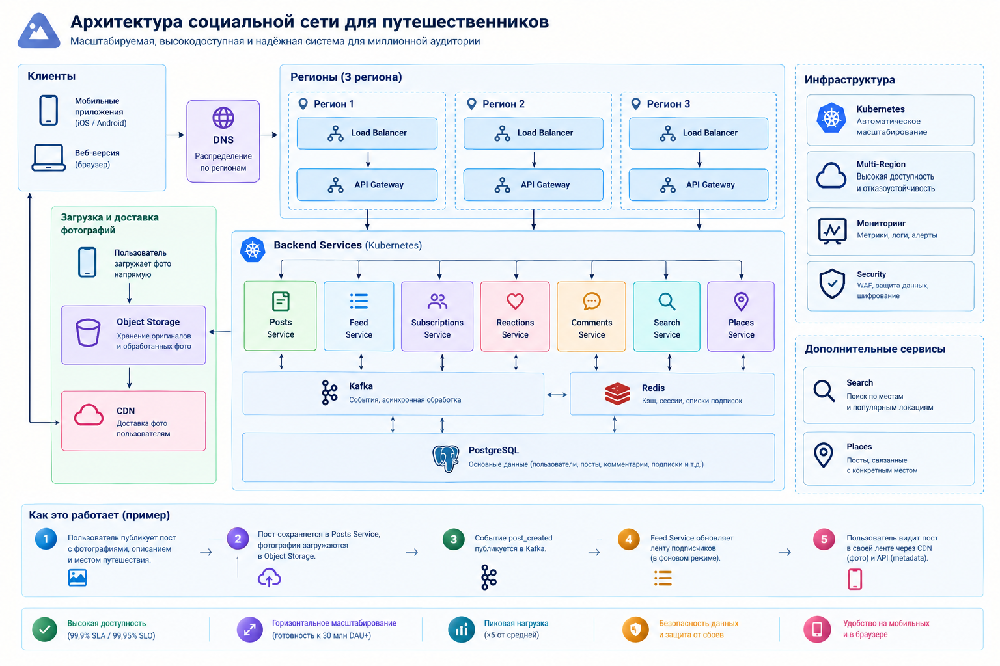

# Социальная сеть для путешественников

Домашняя работа для [курса Владимира Балуна по System Design](https://balun.courses/courses/system_design).

## Функциональные требования:

### Посты (Post)

Пользователь может публиковать посты из путешествий.

Пост содержит:

- фотографии (максимум - 10 штук)
- текстовое описание (максимум - 2000 символов)
- привязку к конкретному месту путешествия
- посты хранятся бессрочно

### Лайки (Reactions)

- Пользователь может оценивать посты других путешественников

### Комментарии (Comments)

- Пользователь может оставлять комментарии к постам
- Пользователь может открывать список комментариев к постам и читать их

### Подписки (Subscriptions)

- Пользователь может подписываться на других путешественников
- Пользователь может отписываться от других путешественников
- Число подписок и подписчиков не ограничено

### Лента (Feed)

- Пользователь может просматривать свою ленту, сформированную из публикаций пользователей, на которых он подписан
- Посты в ленте отображаются в обратном хронологическом порядке
- Пользователь может просматривать посты другого путешественника
- Пользователь может просматривать свои посты

### Поиск (Search)

- Пользователь может пользоваться поиском популярных мест для путешествий: ввести название региона или города и получить список из 10 мест, популярных у путешественников в этой области

### Места (Places)

- Пользователь может выбрать одно из найденных мест и просмотреть посты, связанные с этим местом.

### Клиенты

Система должна быть доступна через мобильные устройства и браузер

## Нефункциональные требования:

### Аудитория приложения

- Система должна поддерживать не менее 10 млн DAU

- Peak Concurrent Users (PCU) — 1 млн пользователей 

- Предполагается, что в часы максимальной активности одновременно используют приложение около 10% DAU

- В среднем один активный пользователь поддерживает 2 открытых соединения

### Поведение пользователей

- Пользователь в среднем создаёт 0,1 поста в сутки

- Пользователь открывает ленту 20 раз в сутки

- Пользователь ставит 5 реакций в сутки

- Пользователь создаёт 0,5 комментария в сутки

- Пользователь открывает комментарии 5 раз в сутки

- Пользователь выполняет 2 поиска мест в сутки

- Пользователь открывает страницу популярного места 1 раз в сутки

- Пользователь в среднем создаёт 0,2 подписки и 0,2 отписки в сутки

### Сезонность

Ожидается повышение пользовательской активности в периоды сезонного спроса на путешествия:

- 31 декабря – 8 января — новогодние праздники

- 1–11 мая — майские праздники

- 1 июня – 31 августа — летний отпускной сезон

Для расчета пиковой нагрузки используется коэффициент ×5 относительно среднего RPS. Коэффициент учитывает повышение пользовательской активности в часы максимальной нагрузки и в периоды сезонного спроса.

### Лимиты и ограничения

- Один пост содержит не более 10 фотографий

- Длина текста поста — не более 2000 символов

- Одна страница ленты содержит 20 постов

- Одна выдача комментариев содержит 20 комментариев

- Поиск возвращает до 10 популярных мест

### Временные ограничения

Производительность измеряется по p95:

- Лайки (Reactions) — ≤ 1 с

- Поиск (Search) — ≤ 2 с

- Комментарии (Comments) — ≤ 1 с

- Посты (Posts) — ≤ 1 с

- Лента (Feed) — ≤ 1 с

- Места (Places) — ≤ 1 с

### Масштабируемость

- Система должна поддерживать не менее 10 млн DAU

- Архитектура должна позволять горизонтально масштабироваться без изменения бизнес-логики - за счет добавления дополнительных экземпляров приложения

- В часы максимальной активности система должна поддерживать около 1 млн одновременно активных пользователей

- При двух открытых соединениях на одного пользователя система должна поддерживать около 2 млн одновременных соединений

- С запасом система должна поддерживать до 3 млн одновременных соединений

### Доступность

**SLO:** 99,95% доступности в месяц

## Архитектура нашей системы

    
## Исходные данные от бизнеса и аналитиков

### Данные о постах

- пользователь создает в среднем 0,1 поста в сутки (то есть в целом 1 млн постов от пользователей в сутки);
- один пост содержит в среднем 3 фотографии;
- средний размер исходной фотографии — 2 МБ;
- сжатая фотография для просмотра в ленте — 200 КБ;
- размер метаданных одного поста в API — 5 КБ

### Данные о ленте

- пользователь открывает ленту 20 раз в сутки;
- одна страница ленты содержит 20 постов;
- 70% фотографий в ленте загружаются благодаря lazy loading;

### Данные о лайках

- пользователь ставит 5 реакций в сутки;
- один запрос/ответ для операции с реакцией — 1,5 КБ

### Данные о комментариях

- пользователь создает 0,5 комментария в сутки (1 комментарий раз в два дня);
- пользователь открывает комментарии к постам 5 раз в сутки;
- одна выдача комментариев содержит 20 комментариев;
- размер одного комментария в API — 1 КБ;

### Данные о поиске

- пользователь выполняет 2 поиска мест в сутки;
- размер результата поиска — 5,5 КБ (изначально у нас выпадает только список названий мест - без постов пользователей и фотографий)
- пользователь кликает на место из поиска 1 раз в сутки;
- после клика пользователь получает выдачу из 20 постов из популярного места

### Данные о подписках

- среднее количество подписок пользователя — 100

## Предварительные расчеты трафика и RPS для всех подсистем нашего приложения

Примечание: Peak RPS рассчитываем как Average RPS × 5. Коэффициент 5 выбран как запас для пиковых периодов нагрузки.

### Посты (Posts)

В сутки создается 1 000 000 постов.

- Average Write RPS: 1 000 000 постов в сутки / 86 400 секунд ≈ 12 RPS

- Peak Write RPS: 12 RPS × 5 ≈ 60 RPS

Размер метаданных одного поста — 5 КБ.

- API-трафик: 1 000 000 × 5 КБ / 86 400 ≈ 58 КБ/с.

Peak API-трафик: 58 × 5 ≈ 290 КБ/с.

### Подписки (Subscriptions)

Один пользователь делает в среднем 0,2 новых подписки и 0,2 отписки в сутки.

10 000 000 пользователей × 0,2 подписки = 2 000 000 подписок/сутки

10 000 000 пользователей × 0,2 отписки = 2 000 000 отписок/сутки

Всего: 4 000 000 операций/сутки

- **Average RPS**: 4 000 000 / 86 400  ≈ 46 RPS

- **Peak RPS**: 46 × 5 ≈ 230 RPS

Для расчета трафика предполагаем, что один запрос на подписку/отписку — это ~500 байт, а ответ сервиса — тоже ~500 байт.

Итого один запрос/ответ — около 1 КБ.

- **Average API-трафик**: 4 000 000 × 1 КБ / 86 400 ≈ 46 КБ/с.

- **Peak API-трафик**: 46 × 5 ≈ 231 КБ/с.

### Лента (Feed)

#### Чтение персональной ленты пользователя, которая формируется из постов тех людей, на которых он подписан

10 000 000 пользователей × 20 запросов ленты в сутки = 200 000 000 запросов/сутки

- **Average Read RPS**: 200 000 000 запросов ленты / 86 400  ≈ 2 315 RPS

- **Peak Read RPS**: 2 315 RPS × 5 ≈ 11 575 RPS

Одна страница ленты содержит 20 постов. Размер метаданных одного поста — 5 КБ.

- **Average API-трафик**: 200 000 000 × 100 КБ / 86 400 ≈ 231 МБ/с.

- **Peak API-трафик**: 231 × 5 ≈ 1,16 ГБ/с.

#### Обновление ленты всех подписчиков при создании нового поста

В среднем у пользователя 100 подписчиков.

Один новый пост приводит к 1 × 100 = 100 обновлениям лент подписчиков.

Количество обновлений в сутки: 1 000 000 × 100 = 100 000 000 обновлений.

- **Обновления materialized feed - Average Write RPS**: 100 000 000 / 86 400 ≈ 1 157 RPS

- **Обновления materialized feed - Peak Write RPS**: 1 157 × 5  ≈ 5 785 RPS

Основной внешний API-трафик ленты формируется запросами на чтение.

- **Average API-трафик**: 231 МБ/с.

- **Peak API-трафик**: 1,16 ГБ/с.

#### Суммарная нагрузка Ленты:

Суммарный RPS включает чтение пользовательской ленты и внутренние обновления materialized feed подписчиков.

- **Average RPS**: 2 315 + 1 157 ≈ 3 472 RPS
- **Peak RPS**: 11 575 + 5 785 ≈ 17 360 RPS

При этом внешний API-трафик формируется преимущественно запросами на чтение ленты, поскольку обновления materialized feed являются внутренними операциями.

- **Average API-трафик**: ≈ 231 МБ/с
- **Peak API-трафик**: ≈ 1,16 ГБ/с

### Лайки (Reactions)

В среднем пользователь ставит 5 лайков в сутки.

Среднее количество реакций: 10 000 000 пользователей × 5 лайков = 50 000 000 реакций/сутки

**Average Write RPS**: 50 000 000 реакций / 86 400 ≈ 580 RPS

**Peak Write RPS**: 580 × 5 ≈ 2 900 RPS

Средний размер запроса/ответа - 1,5 КБ

**Average traffic**: 50 000 000 × 1,5 КБ / 86 400 ≈ 0,87 МБ/с

**Peak traffic**: 0,87 × 5 ≈ 4,34 МБ/с

### Комментарии (Comments)

#### Написание комментария

Пользователь пишет в среднем 0,5 комментария в сутки (1 комментарий раз в два дня)

10 000 000 × 0,5 = 5 000 000 комментариев/сутки

**Average Write RPS**: 5 000 000 / 86 400 ≈ 58 RPS

**Peak Write RPS**: 58 × 5 ≈ 290 RPS

**Average traffic** ≈ 5 000 000 × 1 КБ / 86 400 ≈ 58 КБ/с.

**Peak traffic** ≈ 58 × 5 ≈ 290 КБ/с.

#### Чтение комментариев под постом

Пользователь открывает комментарии пять раз в сутки.

10 000 000 пользователей × 5 = 50 000 000 запросов/сутки

**Average Read RPS**: 50 000 000 / 86 400 ≈ 580 RPS

**Peak Read RPS**: 580 × 5 ≈ 2 900 RPS

Одна выдача содержит 20 комментариев по 1 КБ. Размер одной выдачи: 20 × 1 КБ = 20 КБ.

**Average traffic:** ≈ 50 000 000 × 20 КБ / 86 400 ≈ 11,6 МБ/с

**Peak traffic** ≈ 11,6 × 5 ≈ 57,9 МБ/с

#### Общая статистика по комментариям

**Average RPS**: ≈ 638 RPS

**Peak RPS**: ≈ 3 190 RPS

**Average traffic**: 0,058 + 11,6 ≈ 11,7 МБ/с

**Peak traffic**: ≈ 11,7 × 5 ≈ 58,5 МБ/с

### Поиск (Search)

Пользователь дважды обращается к поиску в сутки.

10 000 000 × 2 = 20 000 000 запросов/сутки

**Average Read RPS**: 20 000 000 запросов / 86 400 ≈ 231 RPS

**Peak Read RPS**: 231 RPS × 5 ≈ 1 155 RPS

При размере ответа 5,5 КБ:

**Average traffic**: 20 000 000 × 5,5 КБ / 86 400 ≈ 1,27 МБ/с

**Peak traffic**: 1,27 × 5 ≈ 6,37 МБ/с

### Популярные места (Places)

Этот сервис позволяет пользователю просматривать посты, связанные с конкретным популярным местом.

Пользователь открывает одно популярное место из поиска в сутки.

10 000 000 пользователей * 1 запрос = 10 000 000 запросов/сутки

**Average Read RPS**: 10 000 000 / 86 400 ≈ 116 RPS

**Peak Read RPS**: 116 × 5 ≈ 580 RPS

Одна выдача содержит 20 постов. Размер метаданных одного поста — 5 КБ.

Размер одной выдачи: 20 × 5 КБ = 100 КБ.

**Average traffic**: 10 000 000 × 100 КБ / 86 400 ≈ 11,6 МБ/с

**Peak traffic**: 11,6 × 5 ≈ 57,9 МБ/с

### Сводная нагрузка

| Подсистема    | Average RPS | Peak RPS | Average API-трафик | Peak API-трафик |
| ------------- | ----------: | -------: | -----------------: | --------------: |
| Posts         |        ≈ 12 |     ≈ 60 |          ≈ 58 КБ/с |      ≈ 290 КБ/с |
| Subscriptions |        ≈ 46 |    ≈ 230 |          ≈ 46 КБ/с |      ≈ 231 КБ/с |
| Feed          |     ≈ 3 472 | ≈ 17 360 |         ≈ 231 МБ/с |     ≈ 1,16 ГБ/с |
| Reactions     |       ≈ 579 |  ≈ 2 895 |        ≈ 0,87 МБ/с |     ≈ 4,34 МБ/с |
| Comments      |       ≈ 637 |  ≈ 3 185 |        ≈ 11,7 МБ/с |     ≈ 58,5 МБ/с |
| Search        |       ≈ 231 |  ≈ 1 155 |        ≈ 1,27 МБ/с |     ≈ 6,37 МБ/с |
| Places        |       ≈ 116 |    ≈ 580 |        ≈ 11,6 МБ/с |     ≈ 57,9 МБ/с |

